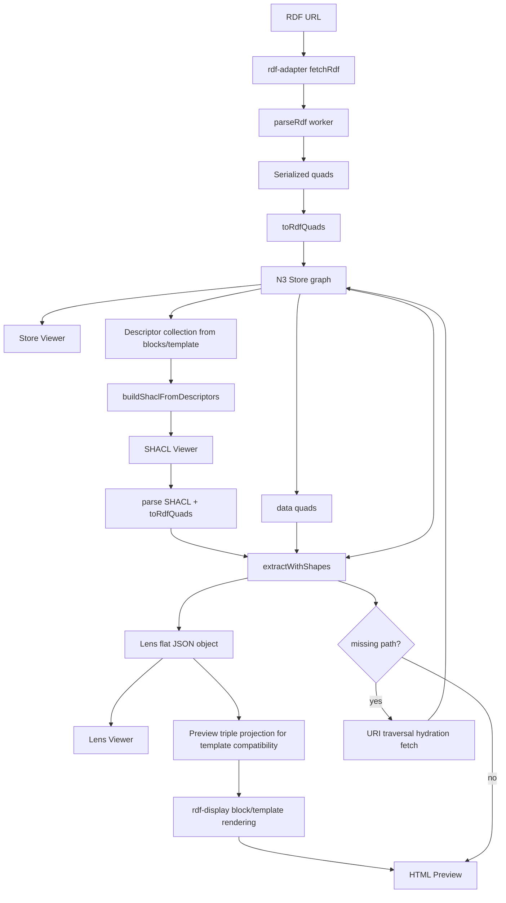

# Lens-first templates for `rdf-adapter` + `rdf-display`

This project now treats **lens extraction output** as the canonical data source for template rendering.

## Core rule

Template preview/rendering should use:

1. RDF graph in store
2. SHACL shape generated/edited in playground
3. Lens-extracted flat JSON object
4. Template rendering from that flat JSON output

No template data should be read directly from raw triples once lens data is available.

---

## End-to-end flow (detailed)

---

## Practical authoring steps

1. Open `public/playground/index.html`
2. Fetch RDF source
3. Confirm graph in **Store Viewer**
4. Generate/adjust SHACL in **SHACL Viewer**
5. Verify extracted object in **Lens Viewer**
6. Build template and preview (rendering uses lens-derived data)
7. Download template/standalone/SHACL artifacts

---

## Template mapping guidance

- For block templates using `data-rdf-predicate` or `data-rdf-path`:
  - SHACL descriptors are generated from those mappings.
  - Lens extraction uses descriptor names/paths.
  - Preview converts lens rows back into compatible display triples so existing block templates keep working.

- Path traversal:
  - Multi-hop descriptors (`data-rdf-path`) are validated against the store.
  - Missing segments trigger URI hydration requests.
  - After hydration, extraction and preview are refreshed.

---

## `rdf-adapter` / `rdf-display` architecture notes

### `rdf-adapter`
- Fetches RDF and parses to worker-serialized quads.
- Emits `rdf-loaded` with:
  - `triples` (display-oriented)
  - `allTriples` (full graph in plain triple form)
  - `rawQuads` (serialized quads for lens pipeline)

### `rdf-display`
- Continues to support list/grid/table/triple-template rendering.
- Block-template rendering supports `data-rdf-predicate` and `data-rdf-path`.
- In the playground flow, the render input is sourced from lens extraction output projection.

---

## Example pages

- Main demo: `public/index.html`
- Template examples: `public/templates/index.html`
- MarineInfo example: `public/templates/marineinfo-collection.html`
- Playground: `public/playground/index.html`
